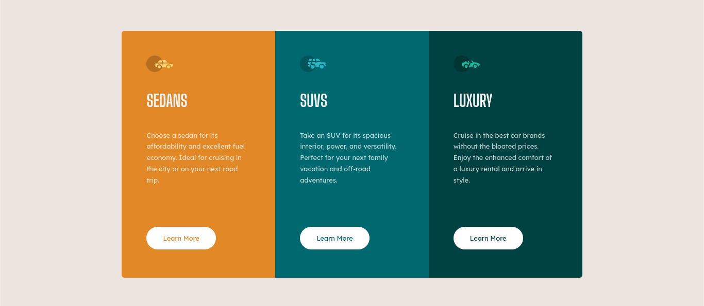

# Frontend Mentor - 3-column preview card component solution

This is a solution to the [3-column preview card component challenge on Frontend Mentor](https://www.frontendmentor.io/challenges/3column-preview-card-component-pH92eAR2-). Frontend Mentor challenges help you improve your coding skills by building realistic projects. 

## Table of contents

- [Overview](#overview)
  - [The challenge](#the-challenge)
  - [Screenshot](#screenshot)
  - [Links](#links)
- [My process](#my-process)
  - [Built with](#built-with)
  - [What I learned](#what-i-learned)
- [Author](#author)

## Overview

### The challenge

Users should be able to:

- View the optimal layout depending on their device's screen size
- See hover states for interactive elements

### Screenshot

 (./images/3ComponentMobile.png)


### Links

- Solution URL: ((https://github.com/hana-chong/3-column-preview-card-component-main)
- Live Site URL: (https://hana-chong.github.io/3-column-preview-card-component-main/)

## My process

### Built with

- Semantic HTML5 markup
- CSS custom properties
- Flexbox
- Visual Studio Code

### What I learned

I was pretty happy with this transition: 

```css
.btn:hover {
    background-color: transparent;
    color:white !important;
    border: solid white 1px;
    transition-duration: 1s;
    transition-timing-function: cubic-bezier(0.25, 0.46, 0.45, 0.94);
}
```


## Author

- Website - [Hana Chong](https://www.githum.com/hana-chong.com)
- Frontend Mentor - [@hana-chong](https://www.frontendmentor.io/profile/hana-chong)

